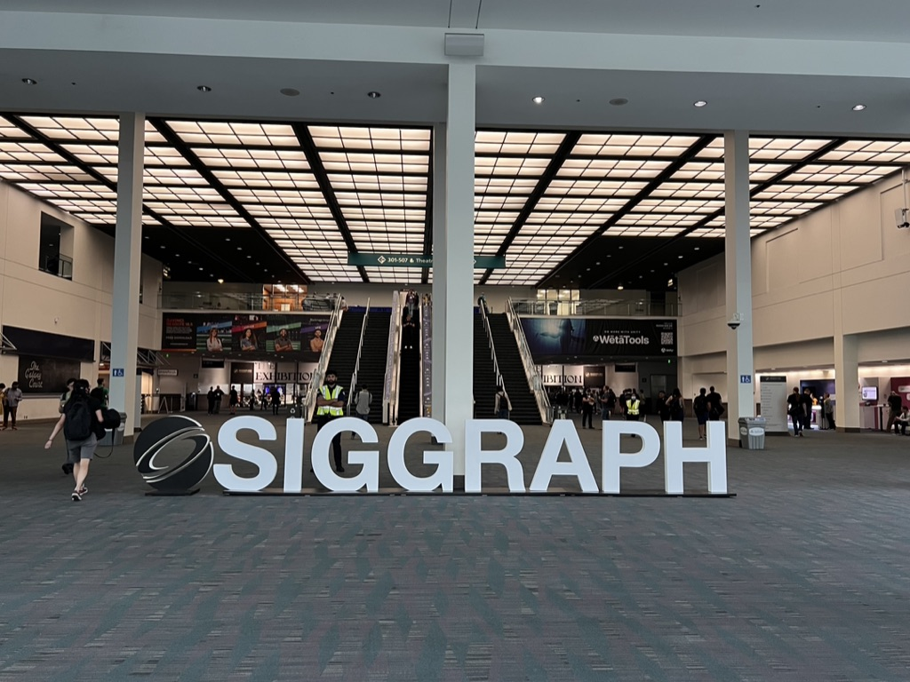
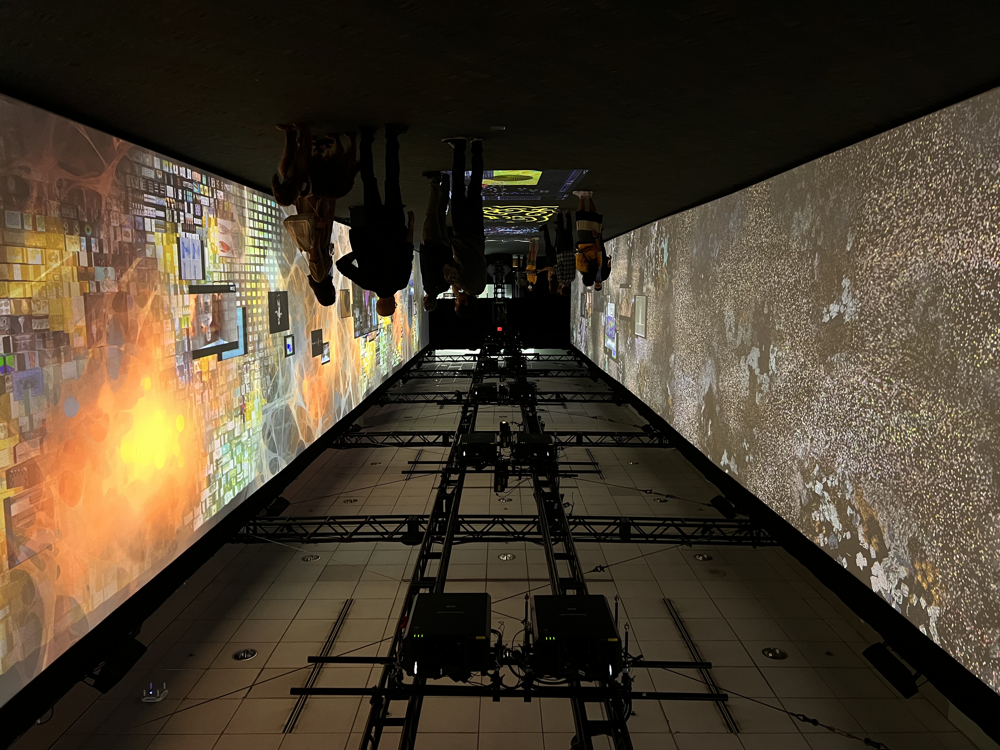
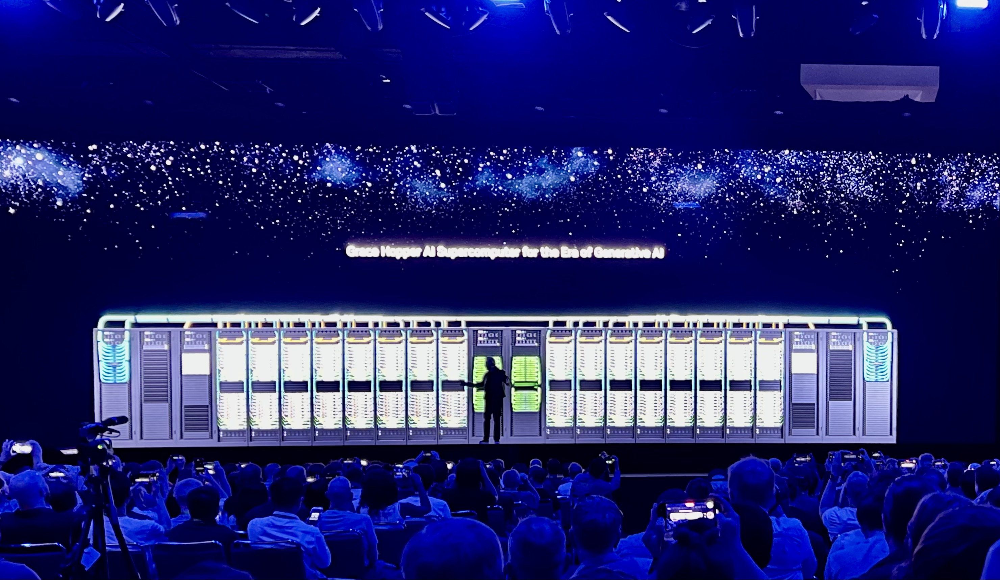
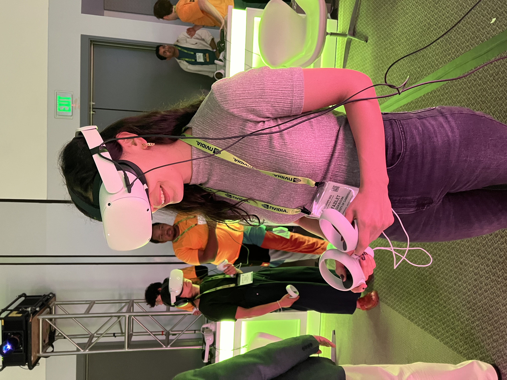
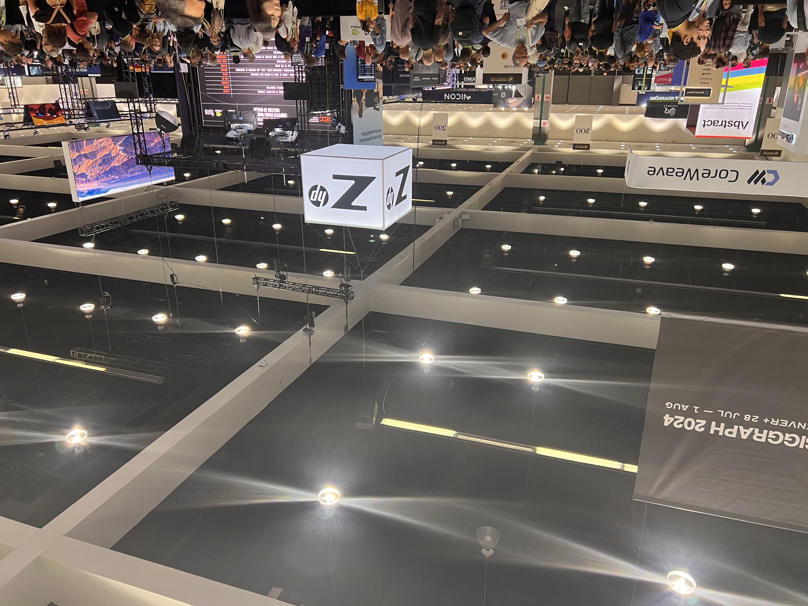
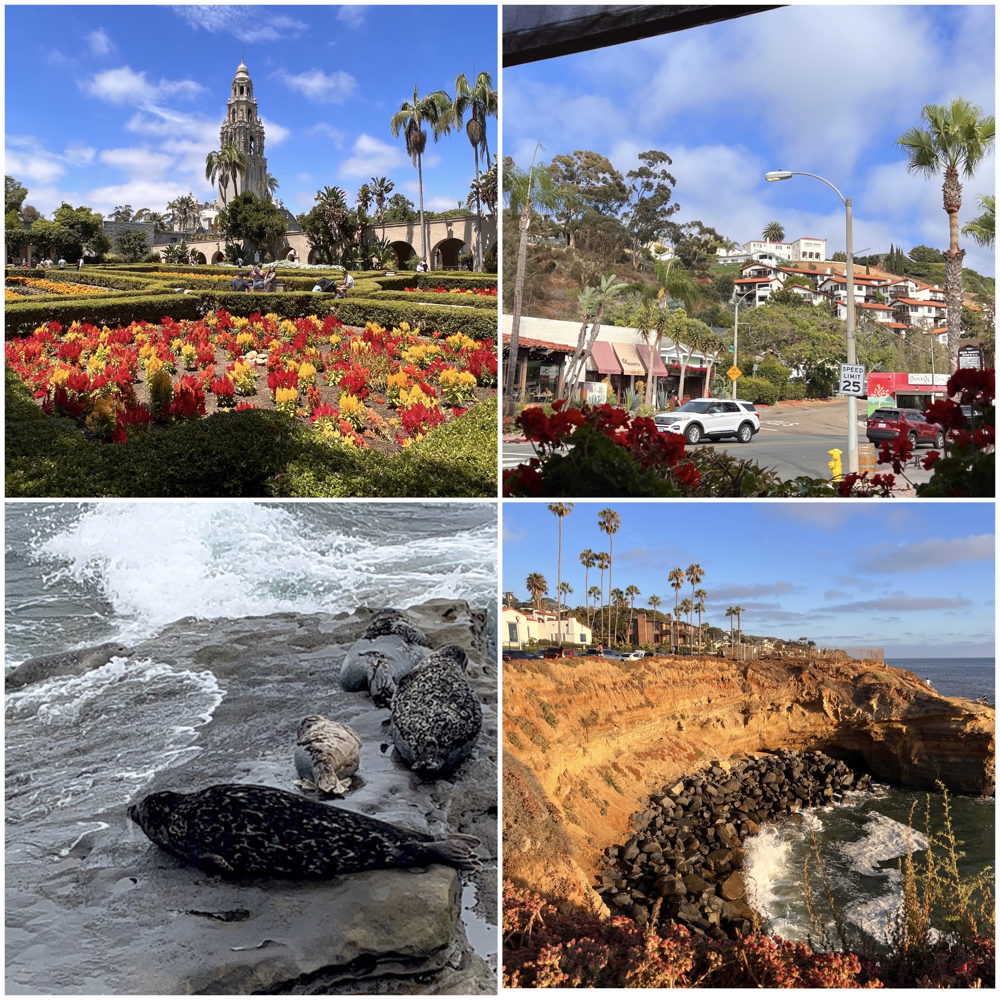

Siggraph is a dream world for computer graphics enthusiasts. This summer, I attended Siggraph for the first time! Here, you can find my notes for the conference.

---

This summer, I had the chance to attend Siggraph 2023 in Los Angeles thanks to the generous travel grant Queens’ and the Department of Computer Science and Technology offered me. Siggraph is the world's largest and most influential annual conference on computer graphics and interactive techniques. It is a unique conference in the sense that not only academicians attend but also people from the film or tech industry gather together to follow up with the latest developments in computer graphics. It was my first time attending this outstanding conference, and as a PhD student researching computer graphics applications, I feel incredibly happy to be given this chance.

The conference started on the morning of August 6th with the registration and badge pick-up. I am glad that I did not experience much jet lag and was able to wake up early to catch the first presentations. The first day was mostly centred around lectures and presentations. I checked the conference programme in advance and attended a lecture of my interest on neural fields and a couple of talks given by digital artists on the recent advances in character animation. The talks were very intriguing as the artists did a breakdown of how they animated or generated characters with their software tools, which was much more complex and time-consuming than I expected. There was also an art gallery inside the conference, where they designed a time tunnel to celebrate the 50th anniversary of Siggraph.

The 2nd day started with a keynote speech by Dr. Darío Gil, the Senior Vice President and Director of IBM Research. The speech was about what’s next in quantum computing, and it was a great talk. Dr. Gill gave insights into the promising future applications of quantum computing. He also mentioned how efficient and effective quantum computing can be with respect to classical computing. Later, after the talk, I also had the chance to meet people from the industry working in our field and got advice from them regarding my career plan.

In the afternoon, I attended a couple of technical presentations well aligned with my current research on material estimation. It was a great opportunity to follow the advances in material estimation/generation and understand what is still missing in the field.

On the morning of August 8th, Jensen Huang, the co-founder, president, and CEO of Nvidia, which is the company that designs and sells the most powerful GPUs for multiple industries, gave a keynote speech to start Day 3 of Siggraph. He introduced the new launch products designed for Generative AI. There were also some short video clips showing the performance development of their GPUs in film-making.  It was the first time I attended an in-person talk given by a founder of a big tech company. Overall, I must say that it was impressive. 

After the talk, I also had the chance to talk to researchers from Microsoft and learn many interesting research topics they have been working on, including understanding the user’s facial expressions for more “empathetic” large language models.

Later in the afternoon, I joined the VR theatre session I booked in advance before coming to LA. The VR theatre is a part of the conference, where each attendee wears a VR headset and holds VR controllers. During the show, we watched four different presentations that all discussed the current global issues, including the war on Ukraine’s culture, artificial intelligence, and drink spiking. The main idea was to take action and try to make a difference. However, I couldn’t move around much due to limited space and sadly watched the shows without interaction.

On Thursday, August 9th, I spent most of my time in the exhibition area, where many graphics-based startups and companies showcased their new products or demos. Some of the outstanding products I have interacted with were Meta’s new VR set, which is much lighter than the one I have tried before, a pain reliever, basically a massager that massages you through electrical signals, an eye-tracked 3D display through which you could see the designs in 3D shape, and a software tool for material texturing that integrates text prompts to generate materials. In the afternoon, I attended the Happy Hour, organised by Adobe’s research team in the exhibition area. During the happy hour, they presented their published papers. Later, we, the attendees, asked questions to researchers along with drinks.

It was already a super exciting but at the same a tiring day. So, I finished the day with the electronic theatre session, where creators showcased their selected animations. There were 22 animations, and each lasted around 10 minutes. I enjoyed watching the theatre so much as all the animations were equally stunning. I think it was my favourite bit of the conference.

The last day of the conference was rather chill since many people were preparing for their return. I attended a few talks aligned with my research and visited the art gallery and exhibition area. Later, I said goodbye to people I had met during the conference and left the convention centre. It was a wonderful experience, and I am glad I attended this year’s Siggraph for the first time!

Before my flight back to London, I had two more days, and I decided to spend these days in San Diego, the Californian city of mixed cultures and beautiful weather. I took a train from Downtown LA to San Diego and stayed around Ocean Beach. Since the city centres are spread around large areas in California, it was hard to see everywhere, but I tried my best to visit the most recommended spots where the mingling of cultures thrives, such as the Old Town. I also visited La Jolla, where I could see the seals. As an amateur photographer, I enjoyed my trip very much since I could capture breathtaking landscapes around the neighbourhood.

As a first-time attendee, I will remember this conference as a memorable experience. Since it gathered all computer graphics enthusiasts in Los Angeles, even the city has become more vibrant. Also, the fact that the conference ran in LA has added to the charm. In this report, I have tried to tell all my great memories during this trip. However, I am sure I have missed many other wonderful ones. I can not thank enough the financial support of Queens’ College and the Department of Computer Science and Technology, which made this adventure possible.

